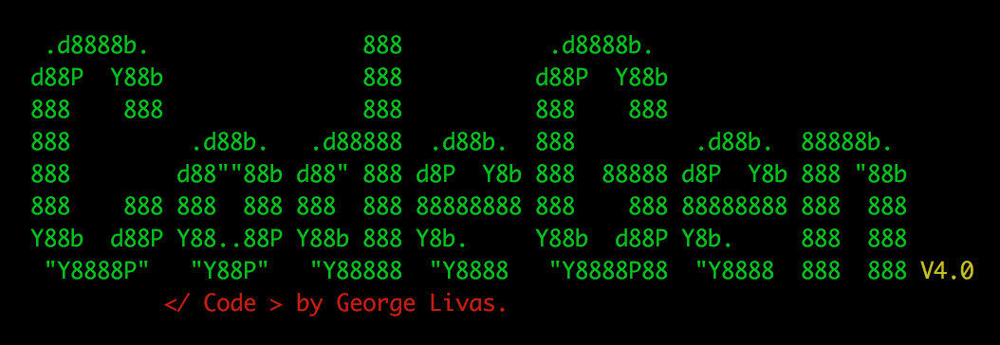
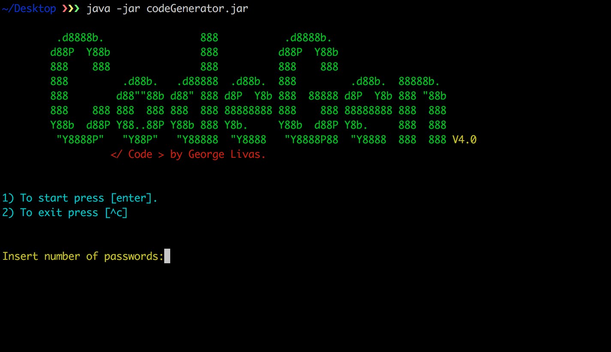

# What is CodeGen?
CodeGen is a code generator which can create codes of 16 characters long and the 
user haves the ability to export them in a text file (.txt). Codegen can create unlimited passwords in seconds. You can also visit the [website](http://georgelivas.github.io/Code-Generator/) for more information! 

[]()
## Security
Each password contains: 

- 4 capital letters (A,B,C)
- 4 lowercase letters (a,b,c) 
- 4 numbers (1,2,3)
- 4 special characters (!,@,£)
**in random order.**

So the outcome is similar to this: 
> $0GyLs!#fjJ"7P49

The generated codes are unpredictable and the possibility of a code been generated twice is 0,013%.

# Getting Started

1. [Download](https://github.com/georgelivas/Code-Generator/releases) the codeGenerator.jar
2. Open a cmd
3. Navigate to the directory where the jar file is located
4. Then type:

```
java -jar codeGenerator.jar 
```
## Demo
<video width="100%" autoplay loop>
  <source src="./Readme_resources/codegen.mov" type="video/mp4">
  
</video>

# System Requirements

* Java 1.8 
* Java Virtual Machine

## Licence
This project is licensed under the MIT License - see the [LICENSE](https://github.com/georgelivas/Code-Generator/blob/master/Licence) file for details.